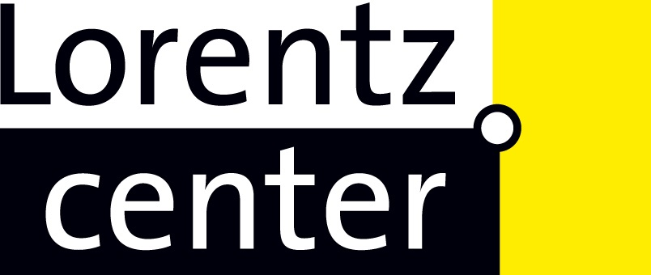
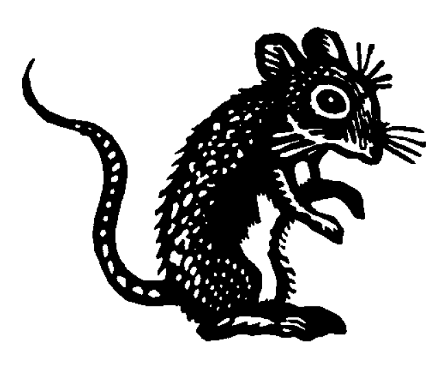

# Bridging Stratigraphic Palaeobiology and Phylogenetics

28 September - 2 October 2026, Leiden

*Emilia Jarochowska, Rachel Warnock, Niklas Hohmann, Laura Mulvey, Johan Hidding*

{width="300"}

# Agenda

::::: columns
::: {.column width="45%"}
1.  Introductions

2.  Objectives

3.  Deliverables

4.  Programme

5.  How we plan to collaborate - space for your input
:::

::: {.column width="10%"}
:::

::: {.column width="45%"}
6.  Pre-workshop questionnaire

7.  Homework

8.  Logistics

9.  Questions
:::
:::::

# Introductions

1.  What is your career stage?

2.  Why are you interested in this workshop?

# Objectives

::::: columns
::: {.column width="20%"}
{fig-align="center" width="300"}   

{fig-align="center" width="150"}
:::

::: {.column width="80%"}
- Strengthen communication between users, empiricists, model developers, and software developers

- Translation of researcher needs into digital infrastructure (e.g., for future grant proposals, sustainable practices)

- Articles on individual research questions developed during the workshop
:::
:::::

# Deliverables {.smaller}

1.  **Draft of a book on stratigraphy & phylogenetic reconstruction from simulated data** developed *during* the workshop collaboratively on GitHub.

2.  **Best-practices recommendations list** for publishing and reviewing phylogenetic analyses and reporting fossil and stratigraphic information as whitepaper.

3.  **Roadmap for digital infrastructure** needed for landmark use-cases of phylogenetic analysis incorporating fossil data. It will contain a list of priorities from the user and developer perspective.

All contributors will be co-authors, provided that they explicitly review and approve the final draft.

# Programme of the meeting

See the workshop repository: https://github.com/MindTheGap-ERC/Lorentz-Workshop

# How we plan to collaborate {.smaller}

- Ad hoc groups with mixed expertise, centered around a research question or task

- GitHub secretary takes notes so not everyone needs to edit

- You do **not** need to be an expert in **all** methods used in the workshop

- We will use the Quarto publishing system for the online book - your work will appear on the website shortly after you have pushed your contribution

- We are seeking participants with prior experience with GitHub, R Markdown or Quarto to take notes during group activities

# Pre-workshop questionnaire {.smaller}

We are collecting input that will help us prepare and create diverse groups. 

If you haven't yet, please fill out the form: 

](QRCode.jpg){fig-align="center" width="30%"}

# Logistics

1.  Is your travel sorted out?

2.  Is your accommodation sorted out?

3.  Do you need any other help?

# Homework

- If you haven't done so yet, fill out the [self-assessment form](https://forms.cloud.microsoft/e/pV8LGE6X84) 

- Reading
  1. Mulvey et al. (2025) [*From fossils to phylogenies*](https://www.cambridge.org/core/journals/paleobiology/article/from-fossils-to-phylogenies-exploring-the-integration-of-paleontological-data-into-bayesian-phylogenetic-inference/BF7DB160A01BDD5183252BFB89A9699F)
  2. Mendes et al. (2025) [*How to validate a  model*](https://academic.oup.com/sysbio/article/74/1/158/7882850)
  3. Holland et al. (2025) [*Stratigraphic Paleobiology*](https://doi.org/10.1017/pab.2024.2)

If you only have time to read 2 - choose the ones furthest from your expertise!

# Any questions, concerns, or suggestions?
